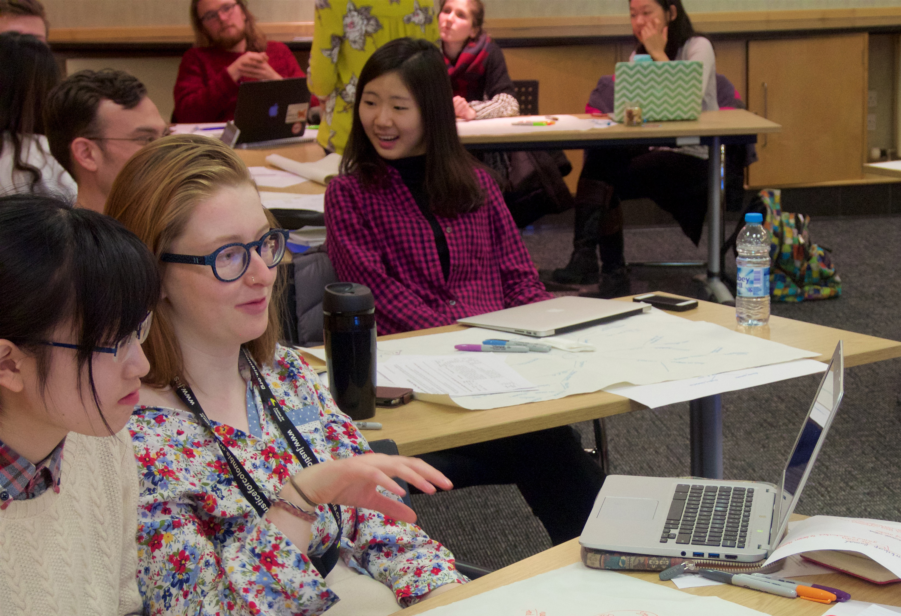

# Interdisciplinary Learning: Notes from the Whiteboard

Delivering an interdisciplinary course is a complex challenge &mdash; ideally the learning is co-produced by both teachers and students, but getting the balance right is difficult. Just dropping lecturers with different backgrounds into the syllabus can result in a series of disconnected presentations which pushes all the work of constructing a coherent whole onto the students. On the other hand, the expense of several lecturers developing and delivering a course which brings together the perspectives and expertise of different disciplines is hard to reconcile with standard models for reourcing teaching. 

By contrast, it ought to be possible to assemble a cohort of students with diverse disciplinary backgrounds, and indeed this is relatively easy to achieve in Masters-level courses. A case in point, which I'll return to shortly, is [Design Informatics](http://www.designinformatics.org), a degree that intentionally brings in students with backgrounds in design and in computing. However, at pre-Honours timetabling clashes between different degrees make it harder to fashion courses that rely on some interdisciplinary mixing of students. 

Together with colleagues [Arno Verhoeven](http://www.eca.ed.ac.uk/school-of-design/arno-verhoeven) and [James Stewart](http://www.homepages.ed.ac.uk/jkstew/), I've been involved in two initiatives that engage with these challenges. Our first stab involved *Design for Informatics* (D4I), one of the courses offered by the School of Design as part of the Design Informatics MA. Our collaboration arose out efforts to build momentum in [Edinburgh Living Lab](http://edinburghlivinglab.org) by setting teams of students to work on 'wicked problems' within the city in collaboration with the Council and the Neighbourhood Partnerships. Development of the course was generously supported by [a PTAS grant](http://www.ed.ac.uk/institute-academic-development/learning-teaching/funding/funding/previous-projects/year/oct-2014/living-lab), and a crucial ingredient was the three of us working 'under the radar' to jointly craft and deliver a course that combined ideas and methods from participatory design, qualitative social science and data analysis.

Once we had developed a formula that worked pretty well for Masters students, we asked ourselves whether it would be possible to adapt the approach to pre-Honours. Of course, the only way to get an answer was to launch a new course, and this was the genesis of [Data, Design and Society (DDS)](https://edinburghlivinglab.github.io/dds/), a 20-point level 8 course that was offered for the first time in 2015/16 by the School of Informatics. Like D4I, DDS adopted a 'learning by developing' pedagogic model in which interdisciplinary teams of students collaborated on a semester-long project which addressed a practical problem.  [Alyssa Alcorn](https://sites.google.com/site/amalcorn0131/) (the course TA) and I worked hard to refine the structure of D4I and to give more explicit guidance to students on how to progress from one phase of work to the next. Since we were somewhat apprehensive (in retrospect, unjustifiably) about letting teams of undergraduates run riot over the city, we decided to focus on an issue that could be researched within the confines of the University, and chose [Food and Sustainability](https://edinburghlivinglab.github.io/dds/project_overview/) as the challenge. This choice was strongly supported by contributions from Alexis Heeren and Alan Peddie of [Social Responsibility and Sustainability](http://www.ed.ac.uk/about/sustainability).

There isn't space here to describe in detail how Alyssa and I ran the course, but both we and the 30 students enjoyed ourselves immensely. Following the current D4I model, we held two 2-hour sessions per week and were very fortunate that the University The University Timetabling unit made it possible to hold most of the sessions in the flexible studio-style space of Room 1.203 (the old IAD 'Resource Room'), 7 Bristo Square. Perhaps the most rewarding part of the experience was that we always built in a large component of group work and student-led interaction to most classes. In contrast to the classical lecture-lecture-lecture approach, this provided space for unplannned, unpredictable and creative learning to occur &mdash; trusting to this process was sometimes a bit nerve-wracking but always rewarding.

---
## Student quotes

> Personally, I feel my learning on this course had gone beyond the scope of learning than any other course I have studied so far. In addition to the academic background knowledge and theories of design, I have improved on skills and learned how to conduct and evaluate research.

> I really enjoyed working in a team and getting to interact with other students from different courses, that I might not have had the opportunity to work with. I felt that our team got off to a bit of a difficult start, not everyone was confident in what they were doing but we really came together as a team especially in the last few weeks.

> Through working on this project during this past semester, I have gained a greater appreciation for the value of collective input. I could not have done this project as effectively or as thoroughly on my own in the time available. Before this course, I had only limited experience in working with a group for an extended period of time, and many of my previous group projects had resulted in a very uneven distribution of the workload. This project was much more\successful, and demonstrated to me how effective a group can be when all its members desire a quality outcome and strive to make that happen. Group work also allows for a wider range of expertise to be utilized, such as one group member’s position as an RA, as well as my own experience in analyzing data.

> As a visiting student, I found it hard to believe that I could work with other full time students to actually make something realistic, feasible, and meaningful, but I was so wrong. Being a visiting student was what made this experience so rewarding for me. ­ I was given opportunities to engage in the University community that I might not have gotten in really any other course, and I also think it gives me a unique perspective.

